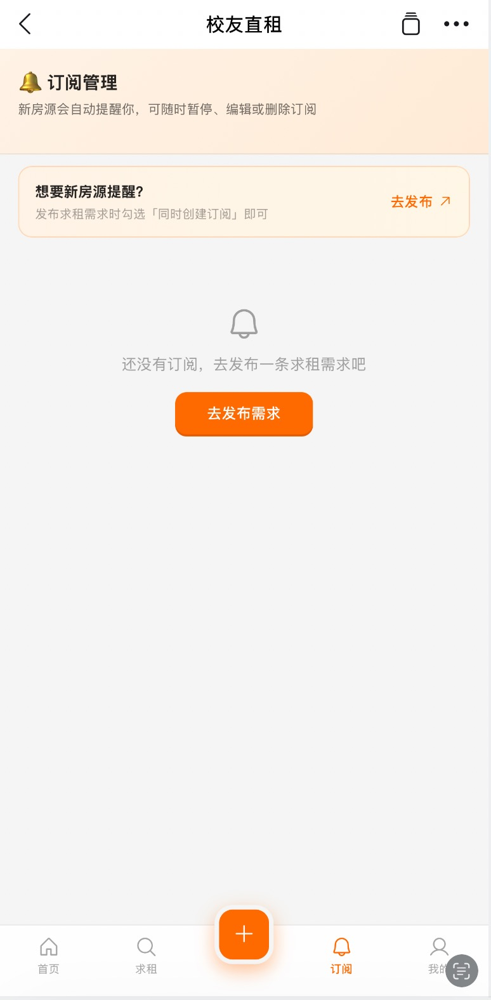

# 校友直租 · 产品引导手册

> 最近小伙伴私下问我有没有租房相关的资源，之前在内网也看过很多求租或者出租相关帖子。所以想搭建租房互助群帮助大家更好地获取相关信息。
>
> 用 AI Coding 搞了个钉钉 H5 应用：「校友直租」，可以在群左下角快捷应用里直接使用。
> （受限于复杂性和精力，目前先只限制于手机 App 端使用，未来再持续迭代）

---

## 快速加入

**租房互助群**（新上架房源、本周精选、避坑互助都在群里）：

👉 **[点击加入租房群](https://qr.dingtalk.com/action/joingroup?code=v1,k1,FJdZhvMtN1z+EskuEeoREzcU2bDfNpcDPksSqNbVO0SdR7ksupjDEA==&_dt_no_comment=1)**

加入后打开「校友直租」应用即可开始使用。

**打开应用**：钉钉内打开「校友直租」工作台应用（或从群左下角快捷应用进入）

---

## 应用界面

### 首页

打开应用，首页展示房源列表。顶部有搜索栏，可以一句话描述找房需求（AI 自动匹配）：


**界面说明：**
- **搜索栏**：输入一句话找房需求，如"西溪附近 6000 以内两居"
- **筛选标签**：区域、价格、户型、标签、其他，支持多条件组合筛选
- **房源卡片**：小区名、户型、面积、月租、标签（房东直租/校友转租/合租拼室友）、通勤时间
- **快捷入口**：签约前必读（合同模板）、区域租金行情、本周精选
- **底部导航**：首页、求租、发布（+）、订阅、我的

### 订阅管理

在「订阅」Tab 设置找房条件，新房源符合条件时自动推送提醒：



**使用场景**：
- 不着急，慢慢等合适的房源
- 设置好条件后，有新房源上架时自动通知
- 可以随时暂停、编辑或删除订阅

### PC 端引导页

PC 浏览器访问会显示引导页，引导使用手机钉钉扫码打开（应用仅限移动端钉钉使用）：


---

## 核心功能

### 1. 找房（首页）

**一句话描述你想要的房子**：

> "西溪附近 6000 以内两居"
> "望京一室一厅，能养猫"
> "杭州滨江，室友是女生就好"

系统用 LLM 自动解析你的需求，几分钟内返回匹配的房源。不用一个个翻列表，也不用到处问人。

**或者直接浏览列表**：首页房源卡片按最新上架排序，点击进入详情。

---

### 2. 出租（发布房源）

**房东操作流程**：

```
填写房源信息 → 提交 → 管理员审核 → 自动推送到租房群
```

**需要填写的信息**：
- 小区名称、户型、面积、月租
- 区域（杭州西溪/滨江、北京望京、上海张江等）
- 标签（房东直租 / 校友转租 / 合租拼室友）
- 详细描述、通勤时间

**审核通过后**：房源自动上架 + 群里推送「新上架」卡片，包含详情链接。

---

### 3. 求租

**没有找到合适的房源？把需求发出来**：

去「求租」Tab，填写你的找房需求：
- 预算范围
- 目标区域
- 户型要求
- 入住时间
- 其他偏好

发布后其他校友/房东能看到，有人匹配时会推送通知。

---

### 4. 订阅匹配

**设置条件，符合条件的房源自动推送给你**：

在「订阅」Tab 填写期望条件（区域、价格、户型等），有新房源匹配时系统自动推送通知。适合不着急、慢慢等的找房方式。

---

### 5. 知识库（避坑指南）

**签约前看一看，避免踩坑**：

首页「签约前必读」入口，内容包括：
- 个人租房合同模板
- 押金注意事项
- 常见骗局案例
- 搬家/入住检查清单

全部整理成文档，随时查阅。

---

### 6. 联系房东

在房源详情页点击「联系房东」按钮：
- **钉钉内**：直接跳转房东钉钉名片，发起会话
- **浏览器**：提示使用钉钉打开

不需要交换电话号码，全程在钉钉内沟通。

---

## 本周精选

**每周五晚 19:00**，租房群自动推送本周精选房源：

- 最新上架且仍在租的 3 套房源
- 本周新上架房源总数
- 每套房源带详情链接，点击直接查看

---

## 找房示例

**场景 1：刚入职，预算有限**

> 我刚拿到 offer，西溪园区附近，预算 5000 以内，有室友也行。

→ 首页搜索框输入这句话 → 系统匹配：西溪八方城（合租，3000/月）、西溪蝶园（主卧，2600/月）...

**场景 2：换园区，想整租**

> 从杭州换到望京，需要一室一厅，预算 8000。

→ 搜索 + 筛选望京区域 → 系统匹配：望京西园四区（1室1厅，7500/月）...

**场景 3：找室友合租**

> 望京两居室想找室友，一人 4000 左右，女生优先。

→ 发布求租需求 → 有人看到后主动联系你。

---

## 常见问题

**Q：为什么需要钉钉扫码授权？**
A：平台只允许「阿里人·一起提前退休」社群成员使用。首次进入钉钉授权验证组织身份，通过后即可正常使用。

**Q：我的房源审核要多久？**
A：通常 24 小时内。审核通过后你会收到钉钉通知，房源自动上架并推送到租房群。

**Q：房源是真实可信的吗？**
A：所有房源都需要管理员审核通过才能上架。虚假房源、中介房源会被直接驳回并拉黑。

**Q：联系房东需要付费吗？**
A：不需要。平台完全免费，不收取任何费用。房东直租，无中介。

**Q：PC 浏览器打不开怎么办？**
A：当前仅支持钉钉内使用（手机 App）。PC 浏览器会显示引导页，引导你用手机钉钉扫码打开。

**Q：怎么加入租房群？**
A：[点击加入租房群](https://qr.dingtalk.com/action/joingroup?code=v1,k1,FJdZhvMtN1z+EskuEeoREzcU2bDfNpcDPksSqNbVO0SdR7ksupjDEA==&_dt_no_comment=1)，审核通过后即可进群。

---

## 产品状态

**当前阶段**：测试版，已上线，社群成员可正常使用。

**已上线功能**：
- 房源发布 / 浏览 / 搜索 / 筛选
- AI 找房（一句话描述需求）
- 求租墙
- 订阅匹配
- 避坑指南（知识库）
- 租金周报
- 本周精选推送
- 联系房东（钉钉名片）
- 管理后台

**持续迭代中**：
- 房源图片（蚂蚁钉限制外部图片加载，目前以文字描述为主）
- 更多区域覆盖
- 用户评价体系
- 房源成交确认机制

---

## 有什么问题？

H5 应用是 AI Coding 出来的，有 bug 或者什么问题可以随时找我改进或者提需求。

希望这个东西有用，可以帮助到大家 🙏

---

> 最后更新：2026-08-23
